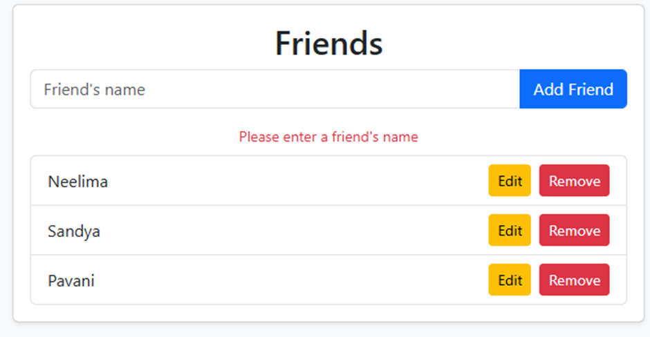
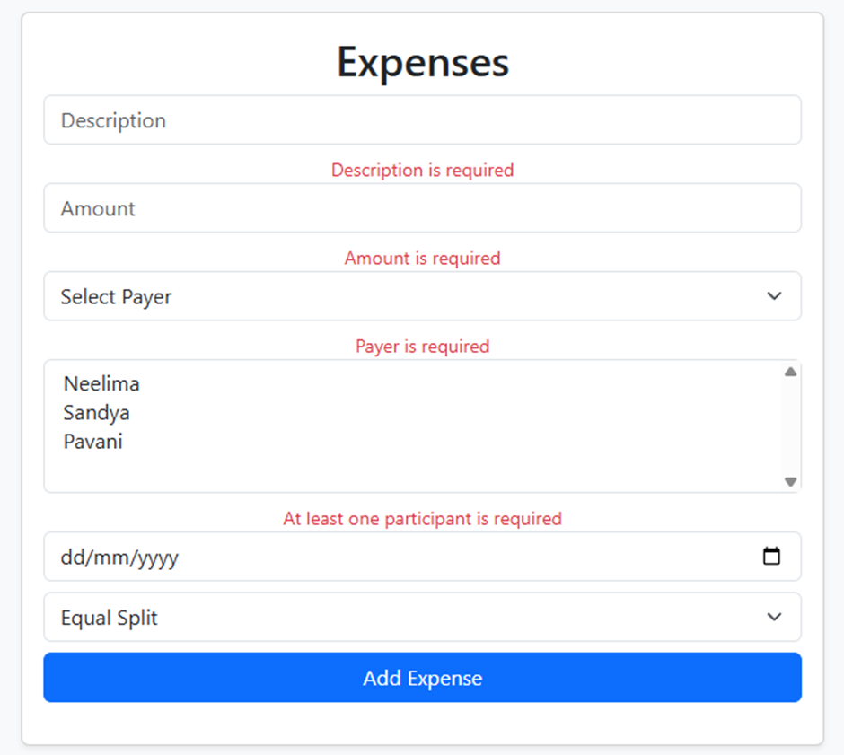
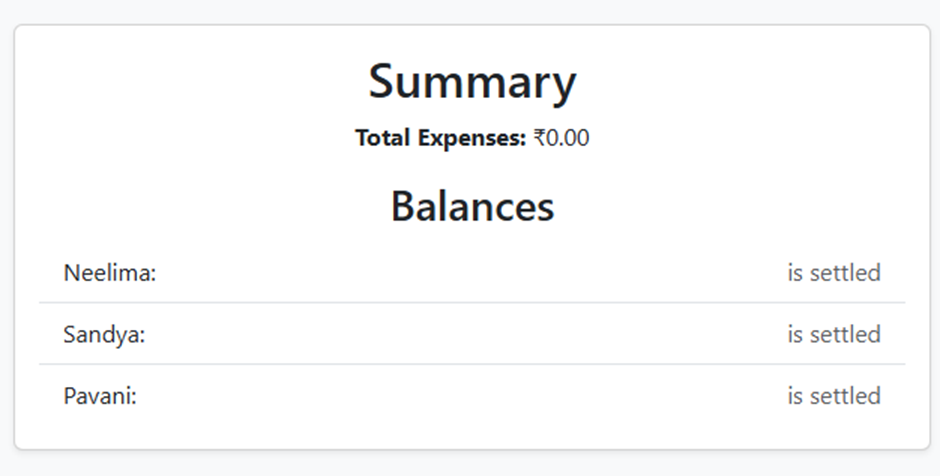
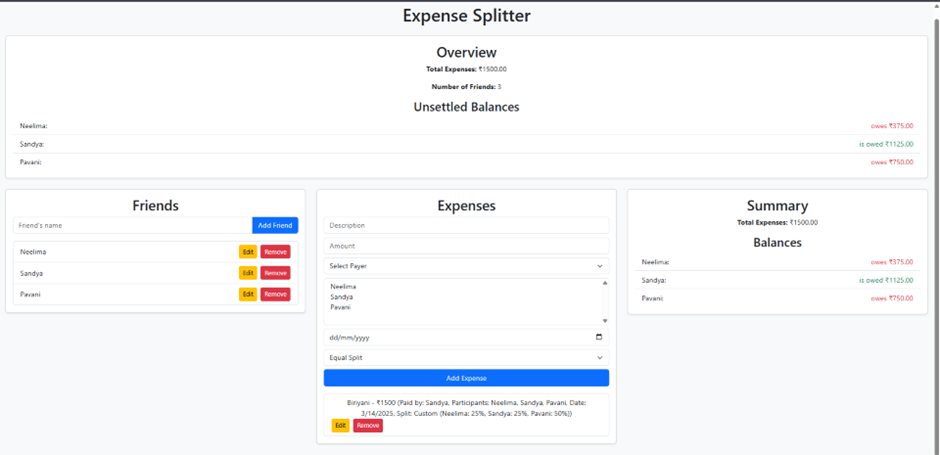
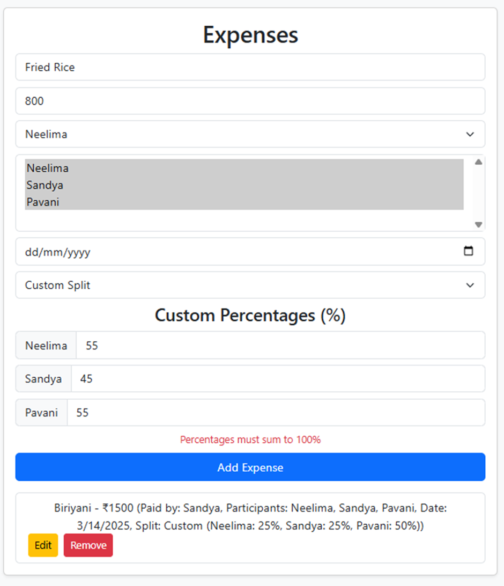

Expense Splitter
A simple web application to manage shared expenses among friends, built with React, Bootstrap, Formik, and Yup.
Overview
Expense Splitter allows users to:
Add and manage friends (add, edit, delete).

Add and manage expenses (description, amount, payer, participants, date, split type).

Calculate and display total expenses and individual balances.

Split expenses equally or with custom percentages.

View an overview of total expenses, number of friends, and unsettled balances.

Amounts are displayed in Indian Rupees (₹), and balances are color-coded (green for "owed", red for "owes").
Features
Friend Management: Add, edit, or remove friends with unique names.

Expense Management: Add, edit, or delete expenses with optional date and custom/equal splits.

Validation: Ensures all required fields (except date) are filled, with custom splits summing to 100%.

Responsive Design: Uses Bootstrap for a clean, mobile-friendly layout.

Overview Dashboard: Shows total expenses, friend count, and unsettled balances.

Prerequisites
Node.js (v14 or later recommended)

npm (v6 or later recommended)

Setup
Clone the repository:
git clone <repository-url>
cd expense-splitter

Install dependencies:
npm install

Start the development server:
npm start
The app will run at http://localhost:3000.

Usage
Add Friends:
Enter a name in the "Friends" section and click "Add Friend".

Edit or remove friends using the buttons next to each name.

Add Expenses:
Fill in the "Expenses" form: description, amount, payer, participants, and split type.

For custom splits, enter percentages for each participant (must sum to 100%).

Click "Add Expense" to save.

View Summary:
Check the "Overview" section for total expenses and unsettled balances.

See detailed balances in the "Summary" section.

Edit/Delete:
Use "Edit" to modify friends or expenses, and "Remove" to delete them.

Project Structure
src/
components/
Dashboard.js: Main app layout with overview and sections.

FriendList.js: Manages friend CRUD with validation.

ExpenseList.js: Manages expense CRUD with validation.

ExpenseSummary.js: Displays total expenses and balances.

services/
FriendService.js: Handles friend data with sessionStorage.

ExpenseService.js: Handles expense data with sessionStorage.

CalculationService.js: Calculates totals and splits.

App.js: Root component.

index.js: Entry point with Bootstrap import.

Dependencies
react: ^18.x.x

react-dom: ^18.x.x

bootstrap: ^5.x.x (for styling)

formik: ^2.x.x (for form management)

yup: ^1.x.x (for validation)

Notes
Currency: Uses Indian Rupee (₹) symbol.

Validation: Powered by Yup; all fields except date are required.

Storage: Data persists in sessionStorage (clears on tab close).

Navigation: Single-page app (SPA); no routing implemented yet.

Future Enhancements
Add React Router for page-based navigation.

Use localStorage for persistent data across sessions.

Enhance UI with Bootstrap modals or alerts for errors.

- Below is a screenshot of the app in action:
  
  
  
  
  
  
